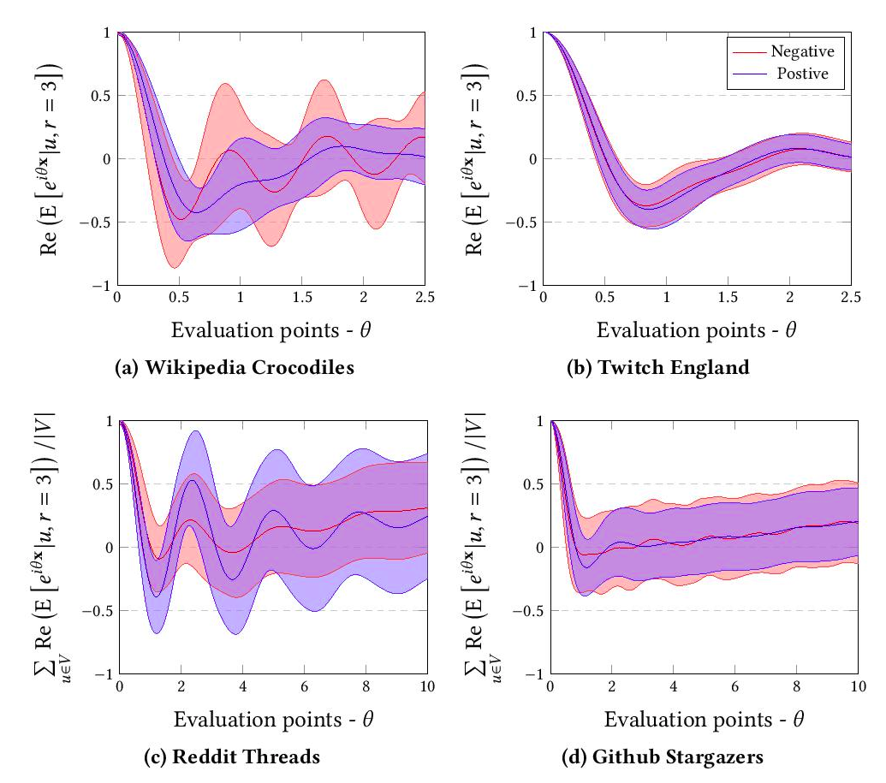

FEATHER
============================================
The Python reference implementation of "Characteristic Functions on Graphs: Birds of a Feather from Statistical Descriptors to Parametric Models."
<p align="center">
  
</p>

### Abstract

<p align="justify">
In this paper, we propose a flexible notion of characteristic functions defined on graph vertices to describe the distribution of vertex features at multiple scales. We describe FEATHER a computationally efficient algorithm to calculate a specific variant of these characteristic functions where the probability weights of the characteristic function are defined by the transition probabilities of truncated random walks. We argue, that features extracted by this procedure are useful for node level machine learning tasks. We discuss that the pooling of these node representations results in compact descriptors of graphs which can serve as features for graph classification algorithms. We analytically prove that FEATHER describes isomorphic graphs with the same representation and exhibits robustness to data corruption. Using the node feature characteristic functions we define parametric models where evaluation points of the functions are learned parameters of supervised classifiers. Our experiments on a number of real world large datasets show that our proposed algorithms create high quality node and graph representations, perform transfer learning efficiently, robust to hyperparameter changes and scale linearly with the input size.</p>

This repository provides the reference implementation for FEATHER as described in the paper:
> Characteristic Functions on Graphs: Birds of a Feather from Statistical Descriptors to Parametric Models.
> [Benedek Rozemberczki](http://homepages.inf.ed.ac.uk/s1668259/) and [Rik Sarkar](https://homepages.inf.ed.ac.uk/rsarkar/).
> 2020.


### Table of Contents

1. [Citing](#citing)  
2. [Requirements](#requirements)
3. [Options](#options) 
4. [Examples](#examples)

### Citing

If you find FEATHER useful in your research, please consider citing the following paper:
```bibtex
>@misc{rozemberczki2020feather,    
       title = {Characteristic Functions on Graphs: Birds of a Feather from Statistical Descriptors to Parametric Models},   
       author = {Benedek Rozemberczki and Rik Sarkar},   
       year = {2020}
       }
```
### Requirements
The codebase is implemented in Python 3.5.2. package versions used for development are just below.
```
networkx          2.4
tqdm              4.28.1
numpy             1.15.4
pandas            0.23.4
texttable         1.5.0
scipy             1.1.0
argparse          1.1.0
```

### Input

#### Node level

<p align="justify">
The code takes an input graph in a csv file. Every row indicates an edge between two nodes separated by a comma. The first row is a header. Nodes should be indexed starting with 0. </p>

The feature matrix is **dense** it is assumed that it is stored as csv with comma separators. It has a header, and rows are separated by node identifiers (increasing). It should look like this:

| **Feature 1** | **Feature 2** | **Feature 3** | **Feature 4** |
| --- | --- | --- |--- |
| 3 |0 |1.37 |1 |
| 1 |1 |2.54 |-11 |
| 2 |0 |1.08 |-12 |
| 1 |1 |1.22 |-4 |
| ... |... |... |... |
| 5 |0 |2.47 |21 |

#### Graph level

The graphs are stored in a JSON file where keys are graph identifiers and values are edge lists. Graph identifiers are consecutive and start with 0. Each individual graph has nodes which are indexed starting with 0. We assume that graphs are connected. 

```javascript
{ 0: [[0, 1], [1, 2], [2, 3]],
  1: [[0, 1], [1, 2], [2, 0]],
  ...
  n: [[0, 1], [1, 2]]}
```

### Options

Learning the embedding is handled by the `src/main.py` script which provides the following command line arguments.

#### Input and output options
```
  --graph-input      STR   Input edge list csv.      Default is `input/edges/ER_edges.csv`.
  --feature-input    STR   Input features csv.       Default is `input/features/ER_features.csv`.
  --graphs           STR   Input graphs json.        Default is `input/graphs/ER_graphs.json`.
  --output           STR   Embedding output path.    Default is `output/ER_node_embedding.csv`.
```
#### Model options
```
  --model-type    STR      FEATHER or Pooled-FEATHER model.     Default is  `FEATHER`.
  --eval-points   INT      Number of evaluation points.         Default is  25.
  --order         INT      Matrix powers approximated.          Default is  5.
  --theta-max     FLOAT    Length of random walk per source.    Default is  2.5.
```

### Examples
Training a FEATHER model.
```sh
$ python src/main.py
```

Changing the scale parameter to increase adjacency matrix powers.
```sh
$ python src/main.py --order 3
```

Decreasing the number of evaluation points.
```sh
$ python src/main.py --eval-points 25
```

Training a graph level FEATHER model with the default dataset.
```sh
$ python src/main.py --model-type FEATHER-G --output output/ER_graph_embedding.csv
```
